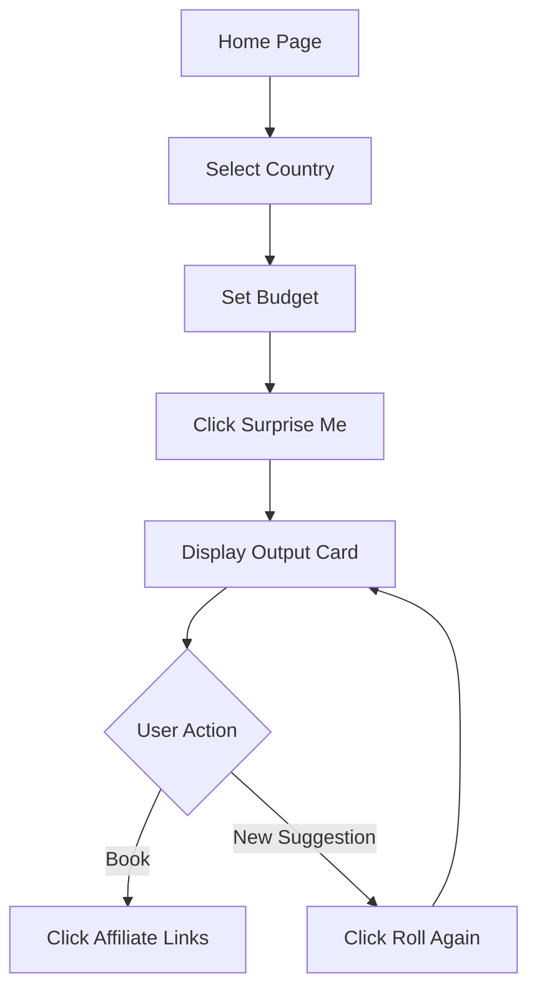

## 1. Product Overview
Getaway Planner is a minimal, frictionless travel inspiration tool that instantly generates curated getaway ideas. Users select their departure country and budget, then receive a complete travel suggestion with destination, 2-night itinerary, and affiliate booking links in one click.

The product solves decision fatigue in travel planning by eliminating endless browsing and providing instant, actionable travel suggestions with direct booking capabilities.

## 2. Core Features

### 2.1 User Roles
No user roles required for MVP - all users have equal access to core functionality.

### 2.2 Feature Module
Our Getaway Planner requirements consist of the following main pages:
1. **Home page**: country selector, budget slider, surprise me button, output card display.

### 2.3 Page Details
| Page Name | Module Name | Feature description |
|-----------|-------------|---------------------|
| Home page | Country selector | Dropdown menu to select departure country from comprehensive list |
| Home page | Budget slider | Interactive slider to set budget range (£100-£2000+) with visual feedback |
| Home page | Surprise Me button | Single CTA button that triggers destination suggestion generation |
| Home page | Output card | Display destination name, 2-night overview, key highlights in card format |
| Home page | Affiliate links | Display booking links for flights, hotels, and activities with partner branding |
| Home page | Roll Again button | Secondary CTA to generate new suggestion with same parameters |

## 3. Core Process
Users arrive on the homepage and immediately see the input interface. They select their departure country from the dropdown menu, adjust the budget slider to their preferred range, then click "Surprise Me" to receive an instant getaway suggestion. The output card displays the destination, brief itinerary, and key highlights. Users can click affiliate links to book flights, hotels, or activities, or use "Roll Again" to get a different suggestion with the same parameters.

## 4. User Interface Design

### 4.1 Design Style
- Primary color: Deep blue (#1e40af) for trust and travel
- Secondary color: Warm orange (#f59e0b) for CTAs and highlights
- Button style: Rounded corners with subtle shadows, primary buttons filled, secondary outlined
- Font: Clean sans-serif (Inter), 16px base size, 14px for secondary text
- Layout: Centered card-based design with generous whitespace
- Icons: Travel-themed emojis and simple line icons for clarity

### 4.2 Page Design Overview
| Page Name | Module Name | UI Elements |
|-----------|-------------|-------------|
| Home page | Country selector | Clean dropdown with flag icons, 300px width, subtle border |
| Home page | Budget slider | Horizontal slider with min/max labels, current value display, smooth animation |
| Home page | Surprise Me button | Large primary button (200px), prominent placement, hover effects |
| Home page | Output card | White card with shadow, destination image placeholder, concise text layout |
| Home page | Affiliate links | Button group with partner logos, opens in new tab, tracking parameters |
| Home page | Roll Again button | Secondary outlined button below output card, maintains user context |

### 4.3 Responsiveness
Desktop-first design with mobile adaptation. Touch-optimized interactions for slider and buttons. Responsive breakpoints at 768px and 1024px for optimal mobile experience.

### 4.4 3D Scene Guidance
Not applicable for this 2D travel planning interface.