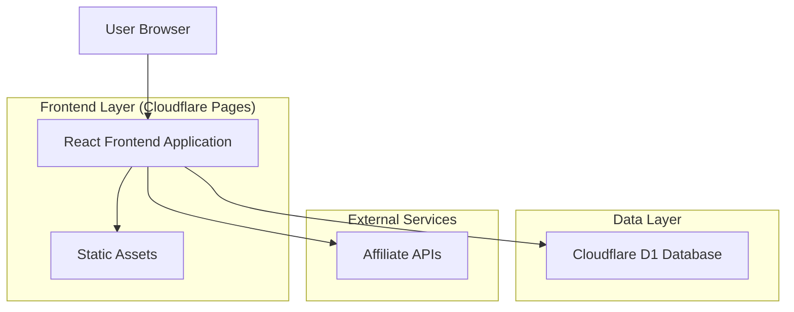
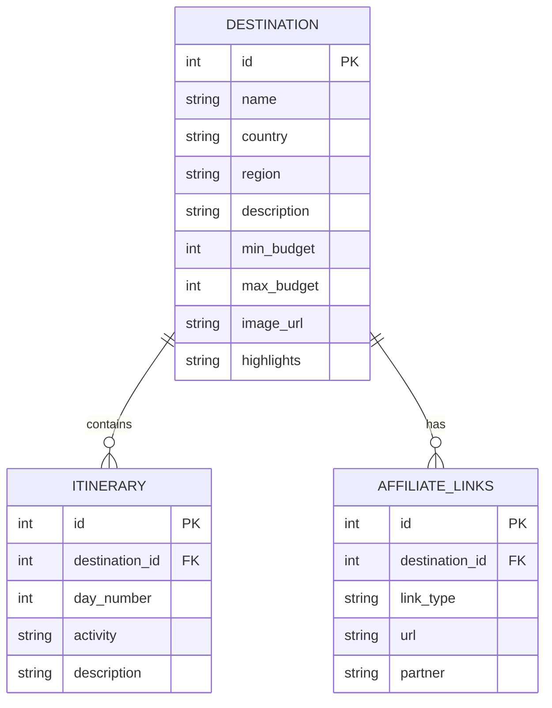

## 1. Architecture design



## 2. Technology Description
- Frontend: React@18 + tailwindcss@3 + vite
- Initialization Tool: vite-init
- Backend: None (client-side only)
- Database: Cloudflare D1 (SQLite)
- Deployment: Cloudflare Pages

## 3. Route definitions
| Route | Purpose |
|-------|---------|
| / | Home page, contains all core functionality |

## 4. API definitions
Not applicable - client-side application with direct database queries to Cloudflare D1.

## 5. Server architecture diagram
Not applicable - static site deployment with client-side logic.

## 6. Data model

### 6.1 Data model definition


### 6.2 Data Definition Language
Destination Table (destinations)
```sql
-- create table
CREATE TABLE destinations (
    id INTEGER PRIMARY KEY AUTOINCREMENT,
    name TEXT NOT NULL,
    country TEXT NOT NULL,
    region TEXT NOT NULL,
    description TEXT NOT NULL,
    min_budget INTEGER NOT NULL,
    max_budget INTEGER NOT NULL,
    image_url TEXT,
    highlights TEXT NOT NULL,
    created_at DATETIME DEFAULT CURRENT_TIMESTAMP
);

-- create indexes
CREATE INDEX idx_destinations_budget ON destinations(min_budget, max_budget);
CREATE INDEX idx_destinations_region ON destinations(region);
CREATE INDEX idx_destinations_country ON destinations(country);
```

Itinerary Table (itineraries)
```sql
-- create table
CREATE TABLE itineraries (
    id INTEGER PRIMARY KEY AUTOINCREMENT,
    destination_id INTEGER NOT NULL,
    day_number INTEGER NOT NULL,
    activity TEXT NOT NULL,
    description TEXT NOT NULL,
    created_at DATETIME DEFAULT CURRENT_TIMESTAMP,
    FOREIGN KEY (destination_id) REFERENCES destinations(id)
);

-- create index
CREATE INDEX idx_itineraries_destination ON itineraries(destination_id);
```

Affiliate Links Table (affiliate_links)
```sql
-- create table
CREATE TABLE affiliate_links (
    id INTEGER PRIMARY KEY AUTOINCREMENT,
    destination_id INTEGER NOT NULL,
    link_type TEXT NOT NULL CHECK (link_type IN ('flight', 'hotel', 'activity')),
    url TEXT NOT NULL,
    partner TEXT NOT NULL,
    created_at DATETIME DEFAULT CURRENT_TIMESTAMP,
    FOREIGN KEY (destination_id) REFERENCES destinations(id)
);

-- create index
CREATE INDEX idx_affiliate_links_destination ON affiliate_links(destination_id);
CREATE INDEX idx_affiliate_links_type ON affiliate_links(link_type);
```

Sample data insertion
```sql
-- insert sample destinations
INSERT INTO destinations (name, country, region, description, min_budget, max_budget, image_url, highlights) VALUES
('Barcelona', 'Spain', 'Europe', 'Vibrant Catalan city with stunning architecture and beaches', 400, 800, 'https://example.com/barcelona.jpg', 'Sagrada Familia, Gothic Quarter, Beach promenade'),
('Lisbon', 'Portugal', 'Europe', 'Hilly coastal capital with trams and historic neighborhoods', 300, 600, 'https://example.com/lisbon.jpg', 'Tram 28, Belém Tower, Pastel de nata');

-- insert sample itineraries
INSERT INTO itineraries (destination_id, day_number, activity, description) VALUES
(1, 1, 'Explore Gothic Quarter', 'Wander through medieval streets and visit the cathedral'),
(1, 2, 'Beach day', 'Relax at Barceloneta beach and enjoy seafood paella'),
(2, 1, 'Historic tram tour', 'Ride iconic Tram 28 through Alfama district'),
(2, 2, 'Belém exploration', 'Visit Jerónimos Monastery and Belém Tower');

-- insert sample affiliate links
INSERT INTO affiliate_links (destination_id, link_type, url, partner) VALUES
(1, 'flight', 'https://skyscanner.com/barcelona-flights', 'Skyscanner'),
(1, 'hotel', 'https://booking.com/barcelona-hotels', 'Booking.com'),
(1, 'activity', 'https://viator.com/barcelona-tours', 'Viator'),
(2, 'flight', 'https://kayak.com/lisbon-flights', 'Kayak'),
(2, 'hotel', 'https://booking.com/lisbon-hotels', 'Booking.com'),
(2, 'activity', 'https://getyourguide.com/lisbon-tours', 'GetYourGuide');
```